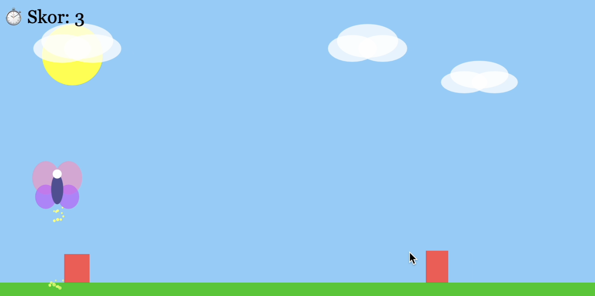

# 🦋 Tuana'nın Kaçış Oyunu 🦋

Bu proje, p5.js kullanılarak yapılmış eğlenceli bir kelebek kaçış oyunudur. Oyunda engellerden kaçınarak en yüksek skoru elde etmeye çalışıyorsunuz.

## Kullanılan Teknolojiler
- HTML5
- JavaScript
- p5.js

## Nasıl Çalıştırılır?
1. `index.html` dosyasını bir tarayıcıda açmanız yeterlidir.
2. Oyun otomatik başlar, yön tuşları ile kelebek kontrol edilir.
3. `←` ve `→` ile hareket, `↑` veya boşluk tuşu (`space`) ile zıplanır.
4. Oyun bittiğinde `r` tuşuna basarak yeniden başlayabilirsiniz.

## Ekran Görüntüsü

## 🔗 Live Demo
Click to play: [Tuana's Escape Game 🦋](https://tuanaerdenn.github.io/EscapeGame/)

## Keyifli oyunlar! 🦋
